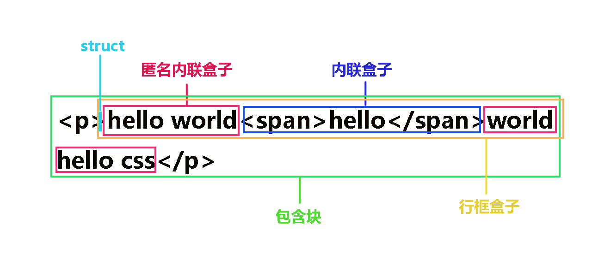

# 内联元素

## 说明

部分参考自 [张晓伟：深入理解-CSS内联元素之line-height](https://segmentfault.com/a/1190000014515126)

## 内联盒模型

本节图片与文字均引自 [张晓伟：深入理解-CSS内联元素之line-height](https://segmentfault.com/a/1190000014515126) 一文

> Tip: 图中用不同颜色的框标注了很多框，这些代表我们下面要说的不同的盒子或不同的概念。
> 
> **inline-box**
> 
> `inline-box` 又名内联盒子，通常由一些标签包裹形成，最常用的如 `` 标签包裹文字会形成内联盒子，那些没有标签包裹的文字默认自己形成一个盒子称为 `anonymous inline box` 匿名内联盒子。
>
> **line-box**
>
> `line-box` 名为行框，从名字就可以看出，它是由单行内联元素形成的一个区域，注意是每一行都会形成，如果文字由五行，就会形成5个行框。行框的高度基本上是由行框中行高最大的内联盒子决定的。我使用基本上这个词，是因为还有其他情况，比如受到 `vertical-align` 属性的影响。
>
> **containing-box**
>
> `container-box` 就是包含块的意思，在内联元素中，包含块是由行框组成的。说白了就是包裹在所有行框外面的那层盒子。
> 
> **struct**
>
> 这个词可能很多同学见的比较少，张鑫旭大神称之为”幽灵空白节点“，我们这里就用直译过来的词”支柱“。
>
>
> 在CSS规范中有这么一句话，`Each line box starts with a zero-width inline box with the element's font an d line-height properties. We call that imaginary box a ”struct"。`翻译过来意思就是每一个行框开始的位置都有一个宽度为0，并且行高和字体大小都与该元素相同的内联盒子。这个假想的内联盒子就被称为“支柱”。简单来说就是可以想象成行框前面有一个宽为0的空字符。
>
>  
> 可能有的人会问，这个东西有什么用那？(⊙v⊙)嗯，用处大了去了，由于其几乎无处不在的特性并且由于宽度为0，我们平时在内联元素中遇到的很多奇怪的问题都是由“struct”引起的。
>

##　内联元素的特殊性

- 没有可视宽度和可视高度的说法，即 clientWidth 和 clientHeight 永远是 0
- 垂直方向完全受 line-height 和 vertical-align 影响，padding 在视觉上没有改变间距（但实际上还是有影响，只是发生层叠，不影响布局）
- 对于非替换元素的内联元素，不仅 padding 不会加入行盒高度的计算， margin 和 border 也都是如此，都是不计算高度，但实际上在内联盒周围发生了渲染

